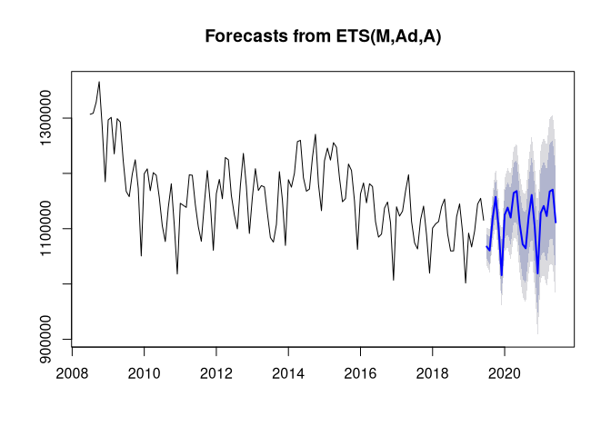
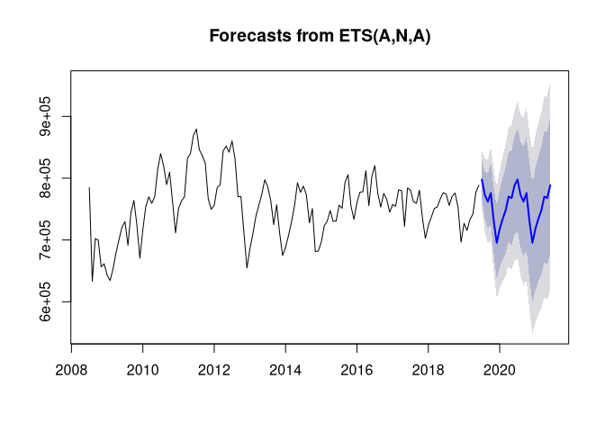

TriMet Ridership Seasonality Analysis
================

## Get the raw data

``` r
library(readxl)
library(dplyr)
```

    ## 
    ## Attaching package: 'dplyr'

    ## The following objects are masked from 'package:stats':
    ## 
    ##     filter, lag

    ## The following objects are masked from 'package:base':
    ## 
    ##     intersect, setdiff, setequal, union

``` r
library(forecast)
```

    ## Registered S3 method overwritten by 'xts':
    ##   method     from
    ##   as.zoo.xts zoo

    ## Registered S3 method overwritten by 'quantmod':
    ##   method            from
    ##   as.zoo.data.frame zoo

    ## Registered S3 methods overwritten by 'forecast':
    ##   method             from    
    ##   fitted.fracdiff    fracdiff
    ##   residuals.fracdiff fracdiff

``` r
monthly_performance_data <- read_excel(
  "/Raw/monthly-performance-data.xlsx", col_names = FALSE, skip = 4,
  col_types = c("date", "numeric", "numeric", "text", "text", "text",
                "text", "text", "text", "text", "text", "text", "text",
                "text", "text", "text", "text", "text", "text", "text",
                "text", "text")
) %>% dplyr::select(1:3)
```

    ## New names:
    ## * `` -> ...1
    ## * `` -> ...2
    ## * `` -> ...3
    ## * `` -> ...4
    ## * `` -> ...5
    ## * … and 17 more problems

``` r
names(monthly_performance_data) <- c("month", "bus", "max")
monthly_performance_data <- monthly_performance_data %>%
  dplyr::filter(!is.na(month))
```

## Create time series objects

``` r
bus <- stats::ts(
  data = monthly_performance_data$bus, frequency = 12, start = c(2008, 7))
max <- stats::ts(
  data = monthly_performance_data$max, frequency = 12, start = c(2008, 7))
```

## Create the models

``` r
bus_ets <- forecast::ets(bus)
max_ets <- forecast::ets(max)
```

## Plot forecasts

``` r
plot(forecast(bus_ets))
```

<!-- -->

``` r
plot(forecast(max_ets))
```

<!-- -->
