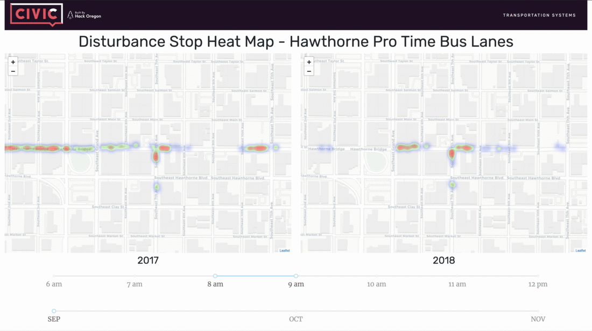

# DEMO_APP
I created this Dash app to help prototype around what our card could look like. The data required for it is self-contained within the `data` folder, so anyone should be able to get this up and running! (assuming I correctly explain how).

## Setup
You'll need to clone this repo, but you only need to use the demo_app directory.
1. `cd` into the demo_app directly.
2. Create the virtual environment. I prefer `conda` so the conda command would be:

    `conda env create -n ho_env -f environment.yml`
    
3. Once the environment is created, activate it with:

    `conda activate ho_env`
4. To run the app, make sure your environment has activated, and you are in the root directory of the app (demo_app). From there, run:

    `python3 index.py`

Which should launch the app @ `localhost:8052`.

NOTE: Right now it is set up to run from local `.csv` files in the `data` dir. The `.env` file points it to use local. If you have local running copy of the API, you can change that flag to work from the API instead.

Let me know if you have problems! - Jeff
